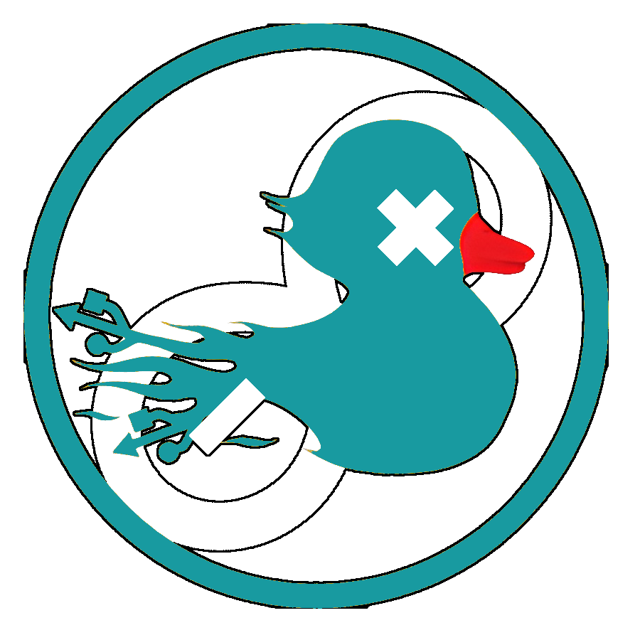

<h1 align="center">Improved DuckDuino</h1>
<h3 align="center">🐤 RubberDucky inside your Arduino UNO</h3>


## ℹ About

This is a fork of the DuckDuino tool, which is used to modify the firmware of an Arduino Uno board to make it act like a RubberDucky.  
You can check out the original DuckDuino tool [here](https://github.com/Lacerda53/duckduino).  
<h3>This improved version counts with:</h3>

- Simplified `script.sh`.
- Some extra functions in the template script, including:   
 `ARROW()` , `ARROWS()` , `TABS()` , `FKey()` , `ALT_F()` , `CTRL_KEY()`  
- Fixed `WINDOWS()` to work with null input.  
- Easy to use `dependencies.sh` and `autoremove.sh` scripts.  
## 🔧 Installation
>(Using a Linux Bash terminal)
1. Clone the repository.  
```bash
git clone https://github.com/PepeBigotes/improvedduckduino
```  
2. Head over to the downloaded files.
```bash
cd improvedduckduino
```
3. Execute the `dependencies.sh` script.  
>(this script relies on the `apt` packet manager, it will not work if your system uses a different one)  
```bash
chmod +x dependencies.sh && sudo ./dependencies.sh
```  
4. Now you can use the `script.sh` located in the `ArduinoUNO_HID` directory.  
>Keep in mind that you need a prepared `.ino` script to create a payload.
```bash
cd ArduinoUNO_HID 
```
```bash
chmod +x script.sh && ./script.sh
```
## 📋 Dependencies
This tool does not work on Windows machines at the moment, you need a Linux to run the shell scripts.  
 
Here's a list of dependencies if you want to install them manually:  
 - `dfu-programmer`: The tool used to modify the Arduino's firmware.  
   Can be installed with the `apt` packet manager or from [this github](https://github.com/dfu-programmer/dfu-programmer).
 - `Arduino IDE`: The aplication used to upload the code/instructions to the Arduino.  
   Can be installed with the `apt` packet manager or from [this site](https://www.arduino.cc/en/software).
